# 1. Identificación de interfaces de red
### Muestra la configuración de red ejecutando: ipconfig /all

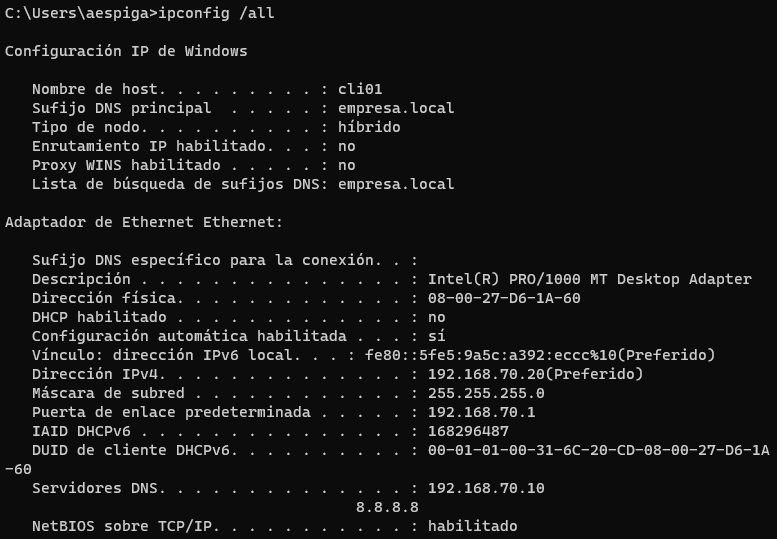

Comando ipconfig /all en la máquina cliente.

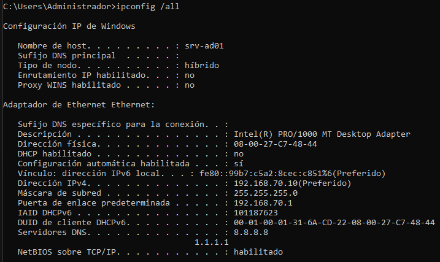

Comando ipconfig /all en la máquina servidor.

Identidad: El equipo se llama srv-ad01 y no tiene un sufijo DNS asignado (está en grupo de trabajo, no en dominio).  
Adaptador: Estás usando una tarjeta virtual Intel PRO/1000.  
IP Estática: Tienes la IP 192.168.70.10. Sabemos que es estática porque dice DHCP habilitado: no.  
Puerta de enlace: Sales a internet (o a otras redes) a través de la 192.168.70.1.  
Dirección MAC: El identificador físico único de tu tarjeta es 08-00-27-C7-48-44 (el prefijo 08-00-27 confirma que es una máquina virtual de VirtualBox).  
DNS Externos: Tienes configurados los DNS de Google (8.8.8.8) y Cloudflare (1.1.1.1).[Documentación oficial](https://learn.microsoft.com/es-es/windows-server/administration/windows-commands/ipconfig)  

Comando ipconfig /all en la máquina servidor.

**¿Qué interfaces de red aparecen?**  
Cliente: Adaptador de Ethernet Ethernet
Servidor: Adaptador de Ethernet Ethernet

**¿Cuál es la interfaz activa?**  
Cliente: La misma, adaptador de Ethernet Ethernet
Servidor: La misma, adaptador de Ethernet Ethernet

**¿Qué dirección MAC tiene la interfaz?**  
Cliente: 08-00-27-D6-1A-60
Servidor: 08-00-27-C7-48-44

# 2. Identificación de adaptadores de red
### Abre PowerShell como administrador y ejecuta: Get-NetAdapter

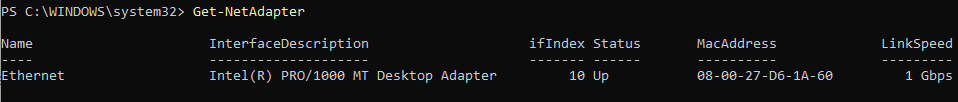

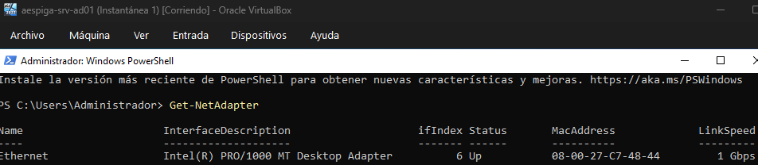

[Documentación oficial](https://learn.microsoft.com/en-us/powershell/module/netadapter/get-netadapter?view=windowsserver2025-ps)

**¿Qué adaptadores aparecen en el sistema?**  
Cliente: Intel(R) PRO/1000 MT Desktop Adapter
Servidor: Intel(R) PRO/1000 MT Desktop Adapter

**¿Cuál es el nombre exacto de la interfaz que se está utilizando?**  
Cliente: Ethernet
Servidor: Ethernet

# 3. Identificación de la configuración IP
### Muestra la configuración IP del sistema: ipconfig

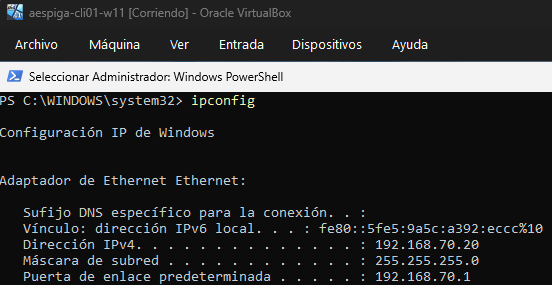

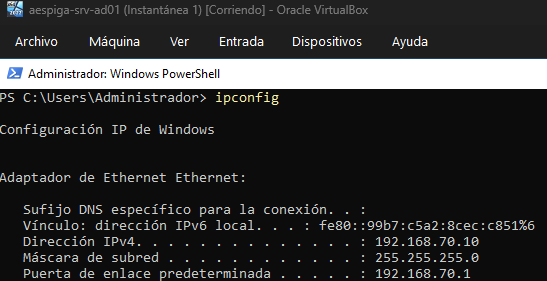

[Documentación oficial](https://learn.microsoft.com/es-es/windows-server/administration/windows-commands/ipconfig)

**¿Qué dirección IP tiene actualmente el sistema?**  
Cliente: 192.168.70.20
Servidor: 192.168.70.10

**¿Qué máscara de red utiliza?**  
Cliente: 255.255.255.0
Servidor: 255.255.255.0

**¿Existe una puerta de enlace configurada?**  
Cliente: Sí, 192.168.70.1
Servidor: Sí, 192.168.70.1

# 4. Análisis de la tabla de rutas
### Muestra la tabla de rutas del sistema ejecutando: route print

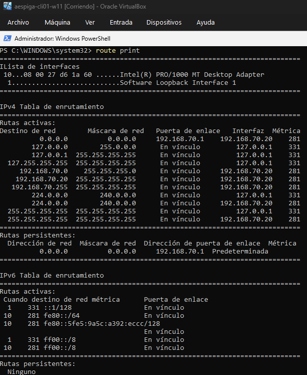

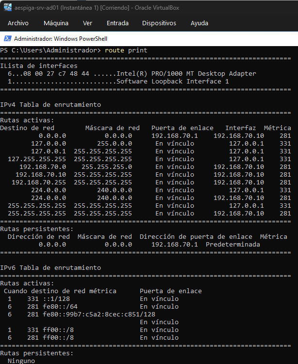

[Documentación oficial](https://learn.microsoft.com/es-es/windows-server/administration/windows-commands/route_ws2008)

**¿Qué red local aparece configurada?**  
Cliente: 192.168.70.0  
Servidor: 192.168.70.0  

**¿Qué interfaz se utiliza para acceder a la red?**  
Cliente: 192.168.70.20 y 127.0.0.1  
Servidor: 192.168.70.10 y 127.0.0.1  

**¿Qué significa cada columna de la tabla?**  
Red de destino: Dirección de red de destino.
Máscara de red: Máscara de red que define el tamaño de la red.
Puerta de enlace: Dirección IP del siguiente salto (router o puerta de enlace).
Interfaz: Dirección IP de la interfaz de red que se utiliza para enviar el tráfico.
Métrica: Prioridad de la ruta (menor es mejor).

# 5. Configuración del nombre del equipo
### Consulta el nombre del equipo ejecutando: hostname

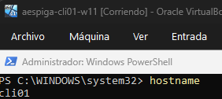

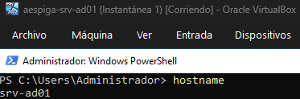

### Servidor: Rename-Computer -NewName win-srv01 -Restart
### Tras reiniciar el sistema, comprueba el cambio ejecutando: hostname
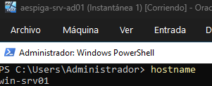

### Cliente: Rename-Computer -NewName win-cli01 -Restart
### Tras reiniciar el sistema, comprueba el cambio ejecutando: hostname
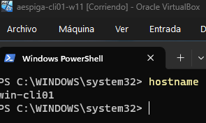  
[Documentación oficial](https://learn.microsoft.com/es-es/powershell/module/microsoft.powershell.management/rename-computer?view=windowsserver2025-ps)

El nombre de equipo (hostname) sirve como un identificador único que permite a los usuarios y dispositivos localizarse entre sí mediante nombres legibles en lugar de memorizar direcciones IP. [Documentación oficial](https://learn.microsoft.com/es-es/windows-server/administration/windows-commands/hostname)

# 6. Configuración de dirección IP estática
### Consulta el nombre de la interfaz de red: Get-NetAdapter

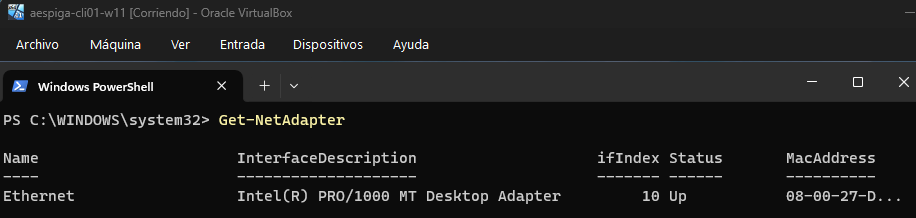

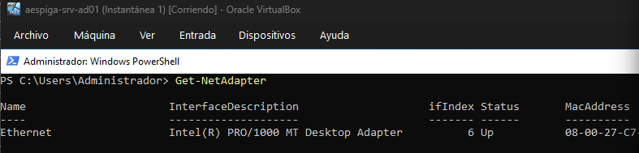

### Servidor: New-NetIPAddress -InterfaceAlias "Ethernet" -IPAddress 192.168.60.10 -PrefixLength 24

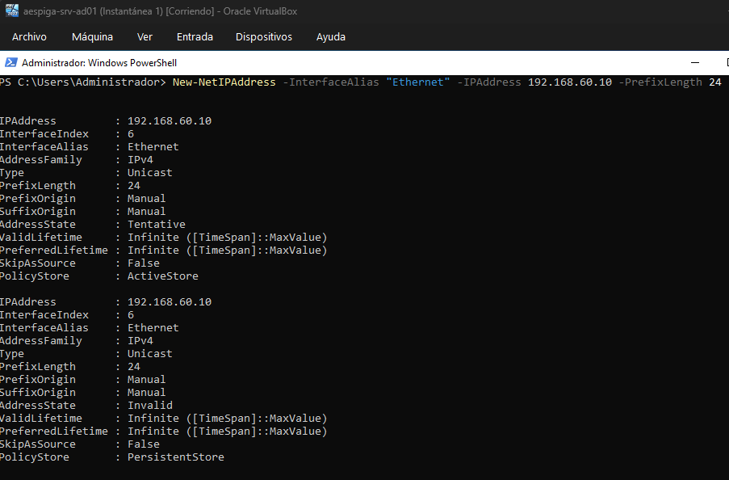

### Cliente: New-NetIPAddress -InterfaceAlias "Ethernet" -IPAddress 192.168.60.20 -PrefixLength 24

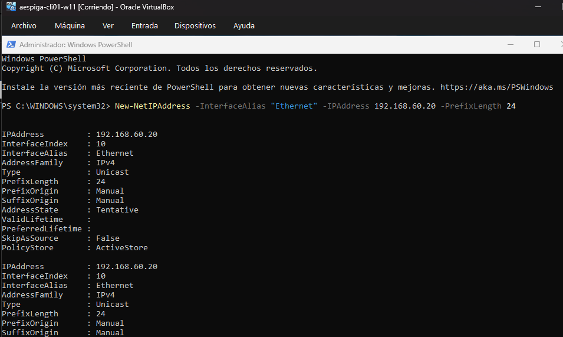

### Comprueba la configuración: ipconfig

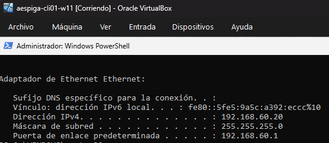

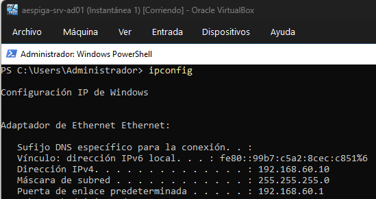  
[Documentación oficial](https://learn.microsoft.com/en-us/powershell/module/nettcpip/new-netipaddress?view=windowsserver2025-ps)

# 7. Verificación de conectividad entre equipos
### Desde cada máquina ejecuta: ping 192.168.60.10 y ping 192.168.60.20

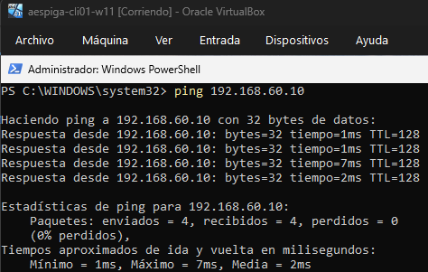

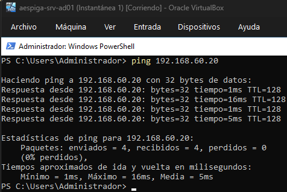

**¿Se reciben respuestas?**  
Sí, se reciben respuestas.

**¿Cuántos paquetes se envían y reciben?**  
Se envían 4 paquetes y se reciben 4 paquetes.

**¿Qué información muestra el comando?**  
El comando muestra la dirección IP del equipo al que se está haciendo ping, el tiempo que tarda en responder cada paquete y si la respuesta es exitosa o no. [Documentación oficial](https://learn.microsoft.com/es-es/windows-server/administration/windows-commands/ping)

# 8. Configuración de resolución de nombres local
### Edita el archivo ejecutando: notepad C:\Windows\System32\drivers\etc\hosts
### Añade las entradas: 192.168.60.10 win-srv01 y 192.168.60.20 win-cli01

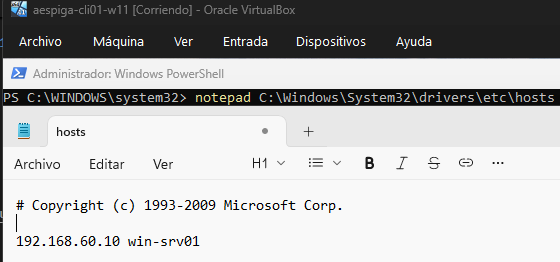

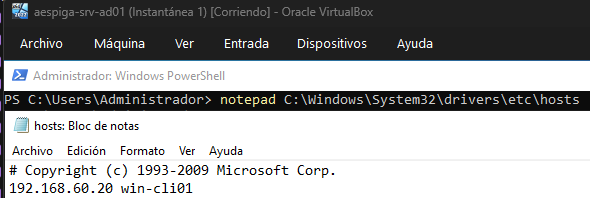  
El archivo hosts actúa como una libreta de direcciones local que el sistema consulta antes que al DNS, vinculando manualmente nombres de dominio con IPs específicas. [Documentación oficial](https://techcommunity.microsoft.com/blog/appsonazureblog/hostfile-entry-on-windows-and-linux-machine/4111820)

### Comprueba la resolución de nombres ejecutando: ping win-srv01 y ping win-cli01

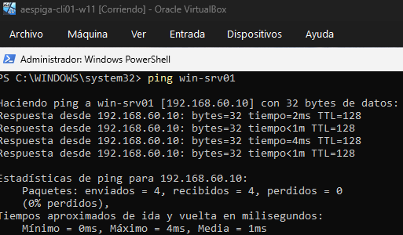

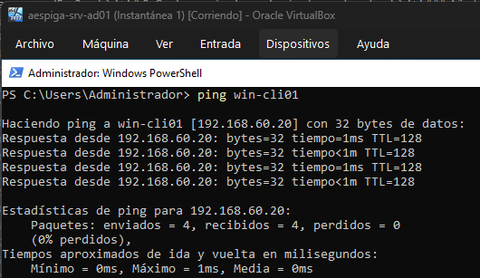  

# 9. Análisis de puertos abiertos
### Muestra los puertos abiertos ejecutando: netstat -ano

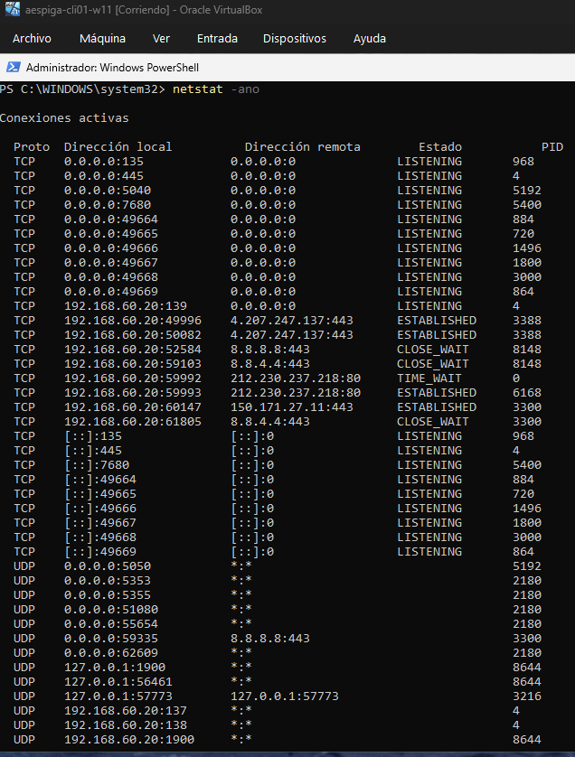

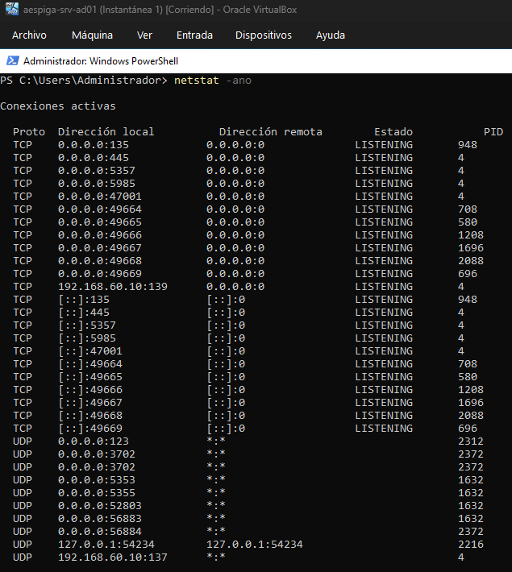

**¿Qué puertos aparecen abiertos?**  
Cliente: 135, 139, 445, 1900, 5040, 5050, 5353, 5355, 7680, 49664, 49665, 49666, 49667, 49668, 49669  
Servidor: 123, 135, 137, 139, 445, 3702, 5353, 5355, 5357, 5985, 47001, 49664, 49665, 49666, 49667, 49668, 49669

**¿Qué significa cada columna mostrada?**  
Protocolo: Protocolo de red utilizado (TCP o UDP).  
Dirección local: Dirección IP y puerto local.  
Dirección externa: Dirección IP y puerto externo.  
Estado: Estado de la conexión (LISTENING, ESTABLISHED, etc.).  
PID: Identificador del proceso que está utilizando el puerto.  

**¿Qué indica el identificador de proceso (PID)?**  
El identificador de proceso (PID) es un número único que identifica a cada proceso que se está ejecutando en el sistema. [Documentación oficial](https://learn.microsoft.com/es-es/windows-server/administration/windows-commands/netstat)

# 10. Consulta de la tabla ARP
### Muestra la tabla ARP del sistema: arp -a

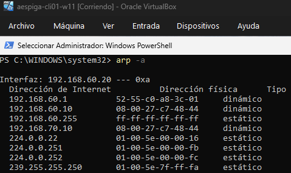

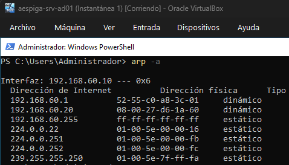

**¿Qué dirección IP aparece asociada al otro equipo?**  
Cliente: 192.168.60.10  
Servidor: 192.168.60.20  

**¿Qué dirección MAC tiene?**  
Cliente: 08-00-27-C7-48-44  
Servidor: 08-00-27-D6-1A-60  
La tabla ARP vincula IPs (direcciones lógicas) con MACs (identificadores físicos de hardware) para que los datos lleguen al dispositivo correcto en la red local. [Documentación oficial](https://learn.microsoft.com/es-es/windows-server/administration/windows-commands/arp)

# 11. Creación de una carpeta compartida
### En win-srv01, crea una carpeta: C:\red

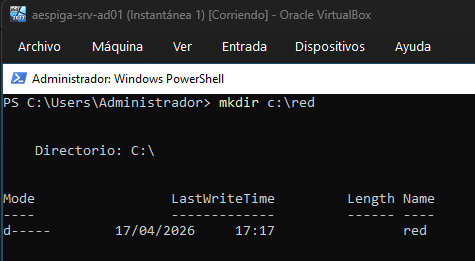

### Abre PowerShell como administrador y comparte la carpeta: New-SmbShare -Name red -Path C:\red

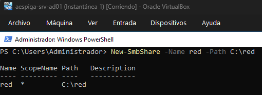

### Comprueba los recursos compartidos: Get-SmbShare

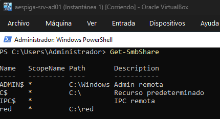

Los recursos compartidos permiten que carpetas o archivos alojados en el servidor sean accesibles para otros usuarios de la red a través del protocolo SMB.  
Su funcionamiento se basa en la combinación de dos capas de seguridad:  
Permisos de Compartición: Controlan el acceso inicial a través de la red (Lectura, Cambio o Control total).  
Permisos NTFS: Controlan el acceso real a los archivos en el disco duro local, siendo estos los más restrictivos y granulares.  
Ruta UNC: Los usuarios acceden mediante una dirección lógica del tipo \\NombreServidor\NombreRecurso. [Documentación oficial](https://learn.microsoft.com/en-us/powershell/module/smbshare/new-smbshare?view=windowsserver2025-ps)

# 12. Acceso al recurso compartido
### Desde win-cli01, accede al recurso compartido ejecutando: net use Z: \\win-srv01\red

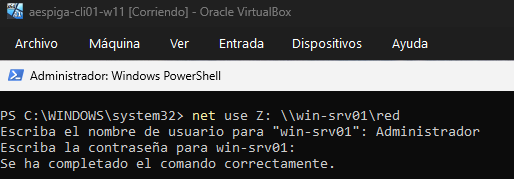

### Comprueba que el recurso aparece montado: net use

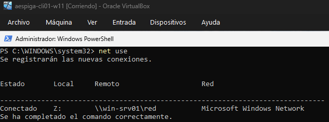

### Verifica el acceso al contenido: dir Z:

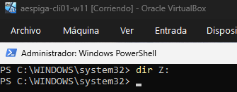

El comando net use permite mapear una carpeta compartida en la red como una unidad de disco local (en este caso, la unidad Z:). Esto facilita el acceso a los archivos y carpetas compartidos, ya que se pueden tratar como si fueran una unidad de disco más del sistema. [Documentación oficial](https://learn.microsoft.com/en-us/previous-versions/windows/it-pro/windows-server-2012-r2-and-2012/gg651155(v=ws.11))

# 13. Transferencia de archivos
### Desde el cliente crea un archivo: notepad prueba.txt

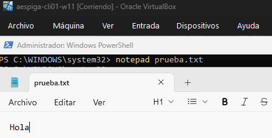

### Copia el archivo al recurso compartido: copy prueba.txt Z:\

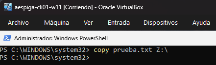

### Comprueba desde el servidor que el archivo aparece en la carpeta compartida.

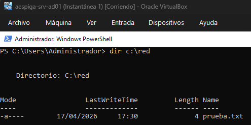

Efectivamente vemos que el fichero prueba.txt se ha copiado correctamente en la carpeta compartida. [Documentación oficial](https://learn.microsoft.com/es-es/windows-server/administration/windows-commands/copy)

# 14. Análisis de conexiones activas
### Muestra las conexiones activas del sistema: netstat -ano

### ¿Qué conexiones aparecen activas?

Cliente: 135, 139, 445, 1900, 5040, 5050, 5353, 5355, 7680, 49664, 49665, 49666, 49667, 49668, 49669  
Servidor: 123, 135, 137, 139, 445, 3702, 5353, 5355, 5357, 5985, 47001, 49664, 49665, 49666, 49667, 49668, 49669

### ¿Qué significa el estado de las conexiones?

Protocolo: Protocolo de red utilizado (TCP o UDP).  
Dirección local: Dirección IP y puerto local.  
Dirección externa: Dirección IP y puerto externo.  
Estado: Estado de la conexión (LISTENING, ESTABLISHED, etc.).  
PID: Identificador del proceso que está utilizando el puerto. [Documentación oficial](https://learn.microsoft.com/es-es/windows-server/administration/windows-commands/netstat)

# 15. Comprobación tras reinicio
### Reinicia ambas máquinas y comprueba que:

### la dirección IP sigue configurada correctamente
### el nombre del equipo se mantiene

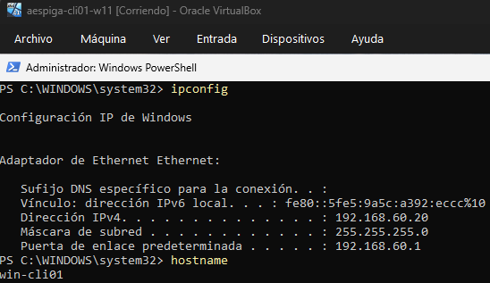

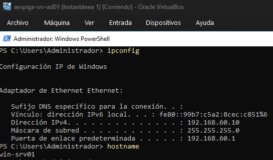

### el recurso compartido sigue disponible

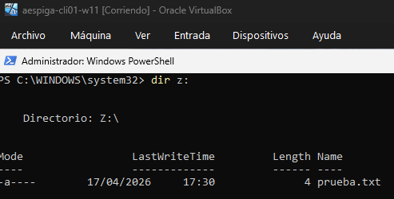

La configuración se mantiene después del reinicio porque Windows almacena estos datos en el **Registro del Sistema** y en archivos de configuración persistentes en el disco duro.

* **Red:** La IP estática se guarda en el registro (`HKEY_LOCAL_MACHINE\SYSTEM\CurrentControlSet\Services\Tcpip`), por lo que el adaptador la solicita al arrancar sin depender de un servidor DHCP.
* **Nombre:** El *Hostname* está grabado en la configuración del núcleo del sistema operativo.
* **Recursos:** El servicio **LanmanServer** (Servidor) se inicia automáticamente al arrancar y vuelve a publicar las rutas compartidas que quedaron registradas como activas en la sesión anterior.